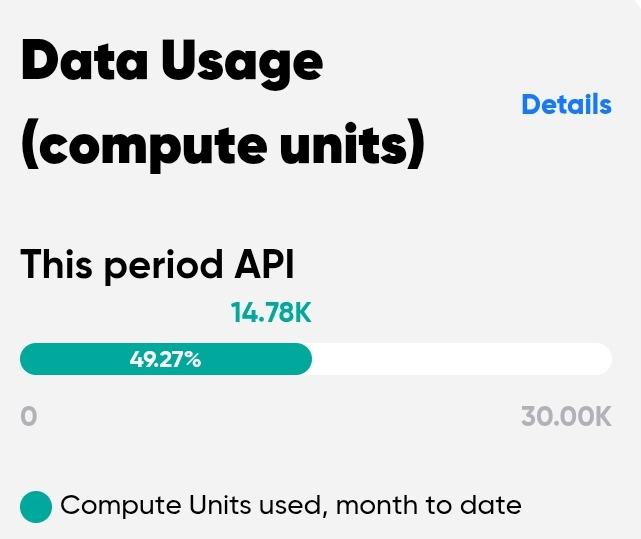

# Solana Token Intel




Real-time Solana token safety scoring and market intelligence powered by **Birdeye Data**.

Built for the **Birdeye BIP Sprint 1** hackathon — April 2026.

---

## Overview

Solana Token Intel is a live dashboard that helps traders discover, analyze, and monitor Solana tokens with confidence. It combines Birdeye's real-time market data with a custom multi-factor risk scoring engine to surface safe opportunities and flag dangerous tokens — all in one clean interface.

---

## Features

### Trending
- Top 20 tokens scored by Birdeye's trending algorithm
- Combined with additional market data for up to 50+ tokens
- Multi-factor risk scoring (0–100) per token
- Filter by Safe / Caution / Danger
- Sort by risk score, volume, or price change
- Sub-tabs: Risk scored view + Gainers / Volume / Txns / Newest

### Live Feed
- Latest token launches on Solana in real time
- Buy/sell pressure indicator per token
- Creation date and time for every pair
- Social links (X, Telegram, Discord, Website)
- Auto-refreshes every 10 seconds in the background

### Whale Radar
- Highest volume pairs rotating across multiple Solana markets
- BUY / SELL direction indicator with arrows
- Volume, price change, and transaction counts
- Gainers and Losers filter
- Auto-refreshes every 15 seconds

### Meme Monitor
- Low market cap tokens (under $10M) with high momentum
- Three views: All, New (last 24h), Hot (most active this hour)
- 60 tokens per page
- Auto-refreshes every 30 seconds

### Smart Money
- Boosted tokens with smart money backing
- 1D / 7D / 30D time period toggle
- Smart buys count, net flow, and trend direction
- Table view ranked by activity

### DeFi Pulse
- Highest liquidity DeFi pairs on Solana
- Gainers and Losers filter
- Minimum $10K liquidity threshold
- Auto-refreshes every 25 seconds

### Token Search
- Search any Solana token by name, symbol, or contract address
- Live dropdown results as you type
- Works across all tokens on Solana

### Risk Scoring Engine
Every token is scored 0–100 based on:
- **Liquidity** — low liquidity = high manipulation risk
- **Price action** — extreme 24h moves flagged as danger
- **Volume spikes** — abnormal volume detected as suspicious
- **Market cap** — very low mcap tokens flagged

Scores map to: **Safe** (70–100) · **Caution** (40–69) · **Danger** (0–39)

### Token Detail Modal
Click any token card to see:
- 24h price chart powered by Birdeye `/defi/ohlcv`
- Full risk breakdown with pass/fail indicators
- Liquidity, volume, FDV, market cap, transaction data
- Creation date and time
- Social links
- View on Birdeye

### Watchlist
- Star any token to save it to your watchlist
- Persists across page refreshes via localStorage
- Accessible via the Watchlist tab

### Shareable Token Pages
Every token has a unique shareable URL:
```
/token/{address}
```

### Dark Mode
- Full dark mode with one click
- Preference saved and persists across sessions

### Auto-Refresh with Pause
- Background refresh on all live tabs
- Pause button to freeze updates while examining a token
- Countdown timer shows next refresh

---

## API Endpoints Used

| Endpoint | Purpose |
|---|---|
| `GET /defi/token_trending` | Fetch top trending Solana tokens |
| `GET /defi/ohlcv` | Fetch 24h price history for charts |

Both endpoints are from the **Birdeye Data API** — [docs.birdeye.so](https://docs.birdeye.so)

---

## Tech Stack

- **Framework** — Next.js 15 (App Router)
- **Language** — TypeScript
- **Styling** — Inline styles + CSS (no UI library)
- **Data** — Birdeye Data API
- **Deployment** — Vercel

---

## Getting Started

### Prerequisites
- Node.js 18+
- A Birdeye Data API key — get one free at [bds.birdeye.so](https://bds.birdeye.so)

### Installation

```bash
git clone https://github.com/cutlerjay109-create/solana-token-intel.git
cd solana-token-intel
npm install
```

### Environment Setup

Create a `.env.local` file in the root directory:

```
BIRDEYE_API_KEY=your_api_key_here
```

### Run Development Server

```bash
npm run dev
```

Open [http://localhost:3000](http://localhost:3000) in your browser.

### Build for Production

```bash
npm run build
npm start
```

---

## Project Structure

```
solana-token-intel/
├── app/
│   ├── api/
│   │   └── birdeye/        # Birdeye API routes (trending + ohlcv)
│   ├── token/[address]/    # Shareable token pages
│   ├── page.tsx            # Main dashboard
│   ├── layout.tsx          # Root layout
│   └── globals.css         # Global styles + dark mode
├── components/
│   ├── DexCard.tsx         # Token card component
│   ├── TokenModal.tsx      # Token detail modal with price chart
│   ├── WhaleTab.tsx        # Whale radar tab
│   ├── MemeTab.tsx         # Meme monitor tab
│   ├── SmartTab.tsx        # Smart money tab
│   ├── TrendingDexTab.tsx  # Gainers / Volume / Txns / Newest
│   └── WatchlistTab.tsx    # Saved tokens
└── lib/
    └── birdeye.ts          # Birdeye API client + risk scoring engine
```

---

## Risk Score Algorithm

```typescript
function calcRiskScore(token) {
  let score = 100;

  // Liquidity check
  if (liquidity < 10_000)       score -= 40;
  else if (liquidity < 50_000)  score -= 25;
  else if (liquidity < 100_000) score -= 10;

  // Price action (extreme pumps = high risk)
  if (priceChange24h > 1000%)   score -= 35;
  else if (> 500%)              score -= 25;
  else if (> 200%)              score -= 15;
  else if (> 100%)              score -= 8;

  // Volume spike (coordinated pump signal)
  if (volumeChange > 100_000%)  score -= 20;
  else if (> 10_000%)           score -= 12;
  else if (> 1_000%)            score -= 6;

  // Market cap (tiny mcap = easy to manipulate)
  if (marketCap < 100_000)      score -= 20;
  else if (marketCap < 500_000) score -= 10;

  return Math.max(0, Math.min(100, score));
}
```

---

## Submission

- **Hackathon** — Birdeye BIP Sprint 1
- **Period** — April 18 – April 25, 2026
- **Built by** — [@levr_nx](https://x.com/levr_nx)
- **Birdeye Discord** — [discord.gg/tbKbCmU5fM](https://discord.gg/tbKbCmU5fM)

---

*Powered by Birdeye Data · Not financial advice*
